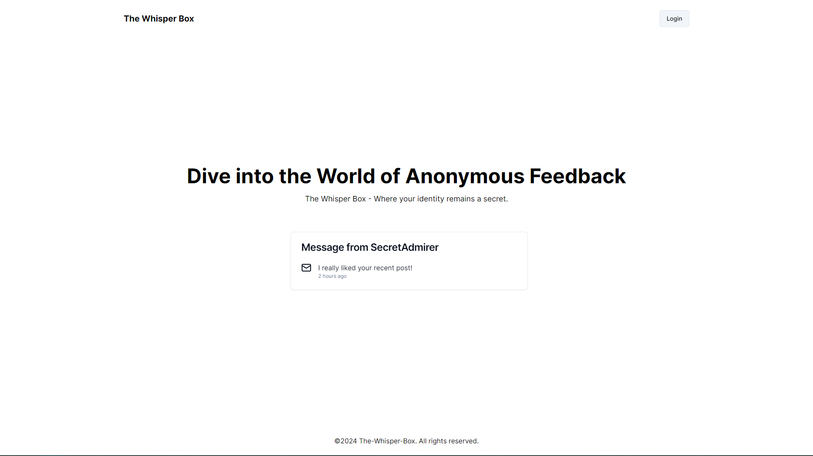
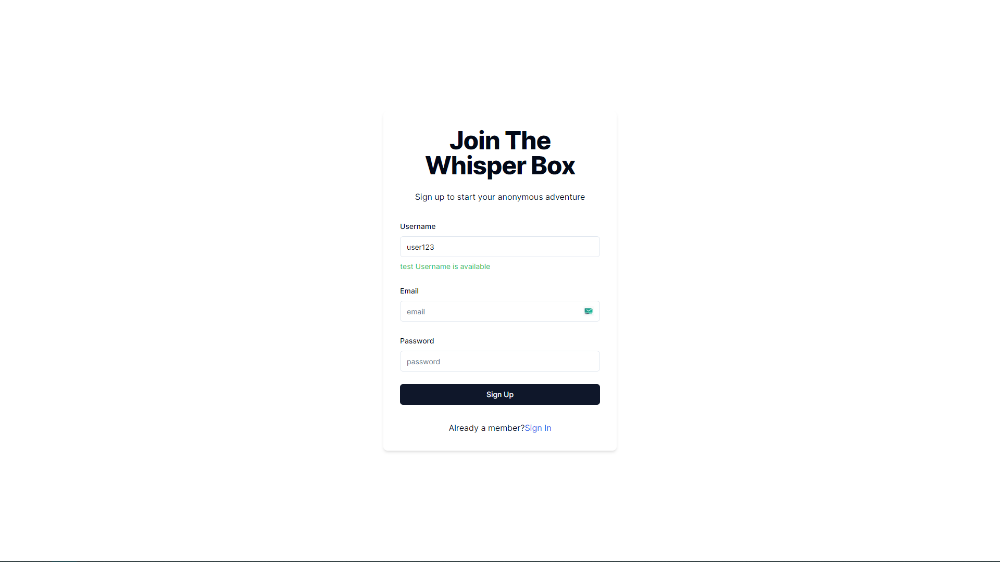
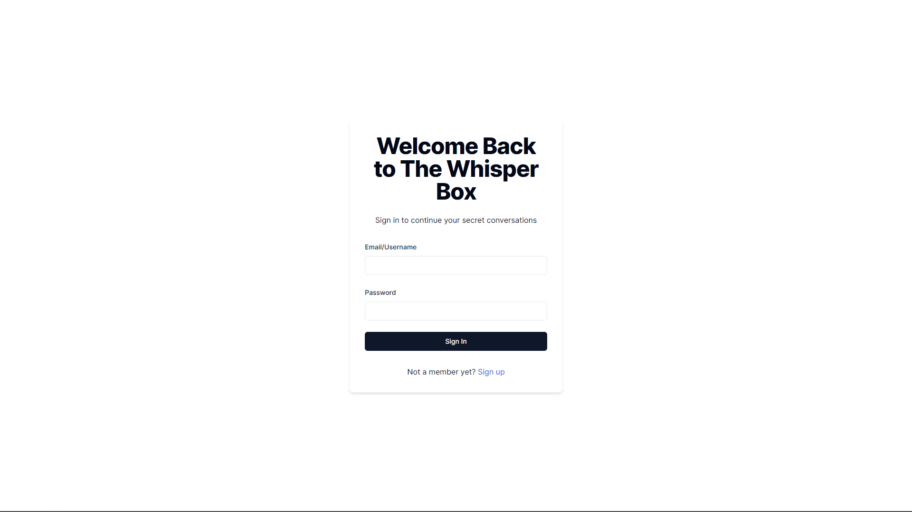
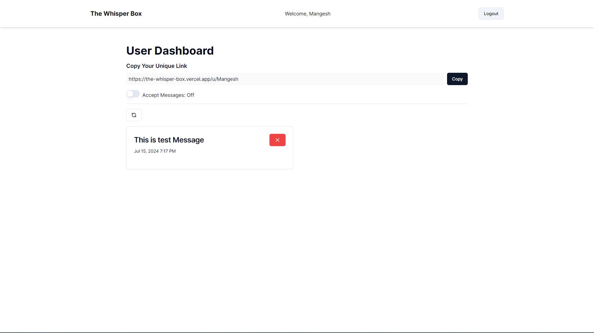
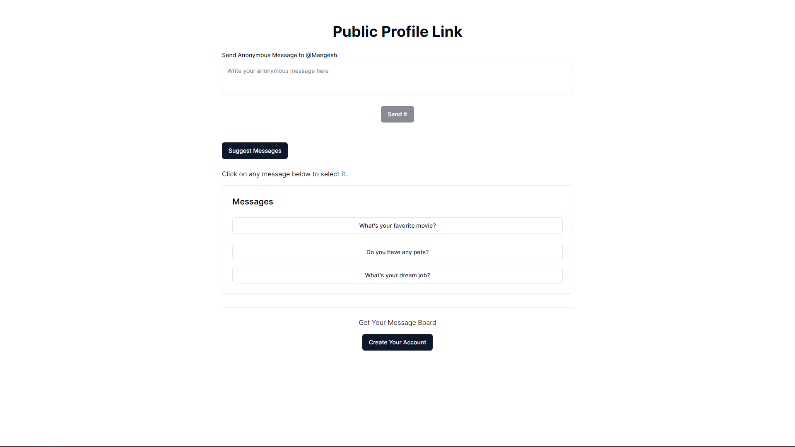

# The-Whisper-Box

The-Whisper-Box is a platform designed to collect anonymous feedback. It allows users to submit honest opinions and insights without fear of attribution.

## Features

- **User Authentication**: Create an account and log in to access your dashboard.
- **Anonymous Feedback**: Users can receive anonymous feedback through a unique link.
- **Dashboard**: View all your anonymous feedback in one place. Copy your unique link to share with others.
- **Feedback Acceptance**: Toggle a switch to accept or stop receiving anonymous feedback.
- **Public Link Page**: Anyone can send anonymous feedback to the user via the public link without creating an account.
- **ChatGPT Integration**: Generate feedback using OpenAI's ChatGPT.

## Technologies Used

- **Next.js**: Framework for building the application.
- **MongoDB**: Database for storing user data and feedback.
- **TypeScript**: Typed language for JavaScript, providing type safety and better development experience.
- **Zod**: Schema validation for ensuring data integrity.
- **Next Auth**: Authentication for handling sign-up and sign-in.
- **Resend**: Service for sending verification emails.
- **Shadcn**: Components library for building responsive and stylish UI.
- **OpenAI ChatGPT**: For generating feedback.

## Screenshots


*Home Page*


*Sign Up Page*


*Sign In Page*


*Dashboard with Feedback List*


*Anonymous Feedback Submission*


## Getting Started

### Prerequisites

- Node.js
- npm or yarn
- MongoDB

### Installation

1. Clone the repository:
   ```sh
   git clone https://github.com/your-username/the-whisper-box.git
   cd the-whisper-box
   ```

2. Install dependencies:
   ```sh
   npm install
   ```

3. Set up environment variables:

   Create a `.env` file in the root directory and add the following:
   ```sh
   MONGODB_URI=your_mongodb_uri
   NEXT_AUTH_SECRET=your_nextauth_secret
   RESEND_API_KEY=your_resend_api_key
   OPENAI_API_KEY=your_openai_api_key
   ```

4. Start the application:

   ```sh
   npm run dev
   ```

5. Open your browser and navigate to `http://localhost:3000`.

## Usage

1. **Sign Up**: Create an account to start using The-Whisper-Box.
2. **Sign In**: Log in to access your dashboard.
3. **Copy Unique Link**: In the dashboard, copy your unique link to share with others.
4. **Public Profile Link**: Send anonymous feedback to user.
5. **Toggle Feedback Acceptance**: Use the switch to accept or stop receiving anonymous feedback.
6. **Receive Feedback**: Others can use your unique link to send anonymous feedback if your acceptance switch is active.
7. **Generate Feedback**: Use the ChatGPT integration to generate feedback.
   

## Deployment

The project is deployed on Vercel. You can view the live application [here](https://the-whisper-box.vercel.app/).

## Contributing

Contributions are welcome! Please fork the repository and create a pull request with your changes.

## Contact

For any inquiries, please reach out to [email](mailto:mangeshraje55555@gmail.com).
